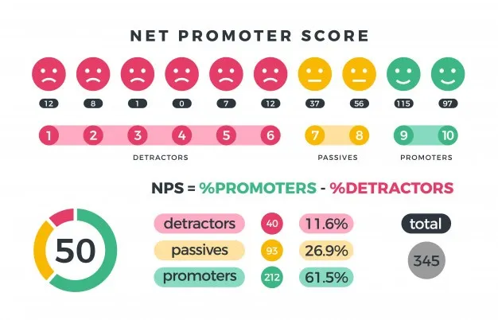

# PythonNPS_Calculation

calculate the Net Promoter Score (NPS) from customer survey data. NPS is a key metric used to measure customer satisfaction and loyalty, based on responses to the question: "On a scale of 1 to 10, how likely are you to recommend our product/service to a friend or colleague?"

In short, NPS tells you:
• How likely your customers are to recommend you.
• Where you stand compared to your competitors.
• What areas need improvement to increase customer loyalty.
It's a quick and easy way to get valuable feedback from your customers and helps you focus on building genuine loyalty.